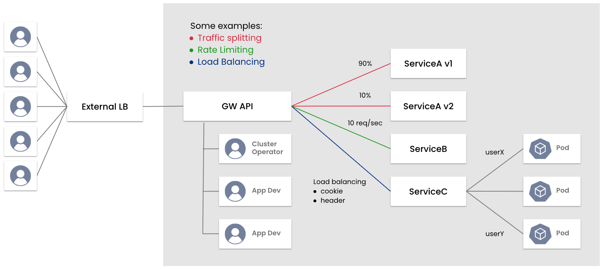

# Calico Ingress Gateway - Introduction & lab setup 

### Table of Contents

- [Calico Ingress Gateway - Introduction \& lab setup](#calico-ingress-gateway---introduction--lab-setup)
    - [Table of Contents](#table-of-contents)
    - [Welcome!](#welcome)
    - [Overview](#overview)
    - [Diagram](#diagram)
    - [Before you begin...](#before-you-begin)
    - [Lab Topology](#lab-topology)
    - [Prerequisites](#prerequisites)
    - [Local Environment Setup](#local-environment-setup)
    - [Lab setup](#lab-setup)
      - [Enable Calico Ingress Gateway](#enable-calico-ingress-gateway)
      - [Verify Gateway API Resource Availability](#verify-gateway-api-resource-availability)


### Welcome!

Welcome to the **Calico Ingress Gateway Instructor Led Workshop**. 

The Calico Ingress Gateway Workshop aims to explain the kubernetes' and IngressAPI native limitations, the differences between IngressAPI and GatewayAPI and the most common use cases where Calico Ingress Gateway can solve.

We hope you enjoyed the presentation! Feel free to download the slides:
- [Calico Ingress Gateway - Introduction](etc/01%20-%20Calico%20Ingress%20Gateway%20-%20Introduction.pdf)
- [Calico Ingress Gateway - Capabilities](etc/02%20%20-%20Calico%20Ingress%20Gateway%20-%20Capabilities.pdf)
- [Calico Ingress Gateway - Migration](Migration.md)

---

### Overview

**About Calico Ingress Gateway**

* **Calico Ingress Gateway** is an enterprise-grade ingress solution based on the Kubernetes Gateway API, integrated with Envoy Gateway. It enables advanced, application-layer (L7) traffic control and routing to services within a Kubernetes cluster. Calico Ingress Gateway supports features such as weighted or blue-green load balancing and is designed to provide secure, scalable, and flexible ingress management for cloud-native applications.

* **Gateway API** is an official Kubernetes API for advanced routing to services in a cluster. To read about its use cases, structure and design, please see the official docs. Calico Enterprise provides the following resources and versions of the Gateway API.

  | Resource         | Versions           |
  |------------------|--------------------|
  | BackendLBPolicy  | v1alpha2           |
  | BackendTLSPolicy | v1alpha3           |
  | GatewayClass     | v1, v1beta1        |
  | Gateway          | v1, v1beta1        |
  | GRPCRoute        | v1, v1alpha2       |
  | HTTPRoute        | v1, v1beta1        |
  | ReferenceGrant   | v1beta1, v1alpha2  |
  | TCPRoute         | v1alpha2           |
  | TLSRoute         | v1alpha2           |
  | UDPRoute         | v1alpha2           |


**This workshop includes the following demos:**

**Custom use cases:**
- **[UC01 - Timeout & KeepAlive](use-cases-custom/uc01%20-%20timeout-keepalive.md)**  
- **[UC02 - Session Affinity](use-cases-custom/uc02%20-%20session_affinity.md)**  
- **[UC03 - mTLS Termination with Header](use-cases-custom/uc03%20-%20mtls_with_ca_cert_forwarding.md)**

**Common use cases:**

- [Advanced routing with sticky sessions / session peristence using header](use-cases-common/01%20-%20sticky_session.md)
- [Load balancing with round robin](use-cases-common/02%20-%20load_balancing_round_robin.md)
- [Load balancing with consistent hash](use-cases-common/03%20-%20load_balancing_consistent_hash.md)
- [Path Based routing with HTTPRoute](use-cases-common/04%20-%20path_based_routing_with_httproute.md)
- [Canary deployments with traffic splitting](use-cases-common/05%20-%20canary_deployments_with_traffic_splitting.md)
- [Advanced TCP routing](use-cases-common/06%20-%20tcp_route.md)
- [TLS Passthrough](use-cases-common/07%20-%20tls_passthrough.md)
- [Security routing based on SNI](use-cases-common/08%20-%20sni_based_routing.md)
- [TLS termination for TCP traffic (SSL Offload)](use-cases-common/12%20-%20ssl_offload_termination.md)
- [Migration from IngressAPI (NGINX) to GatewayAPI(Calico Ingress Gateway)](use-cases-common/11%20-%20NGINX_Migration_with_tool.md)

---

### Diagram




### Before you begin...

**IMPORTANT**

### Lab Topology

The following lab is based on Kubernetes cluster setup on either EKS or AKS.

---
### Prerequisites
The following are the basic requirements to get going.

- Git
- jq
- kubectl
- Terminal (bash, zsh)

---
### Local Environment Setup


1. Ensure your environment has these tools:
    <details>
    <summary><code>install tools</code></summary> 


        # For Linux
        sudo apt update -y
        sudo apt-get install bash-completion jq git -y 
          

        # Install kubectl on Linux x86-64
        curl -LO "https://dl.k8s.io/release/$(curl -L -s https://dl.k8s.io/release/stable.txt)/bin/linux/amd64/kubectl"

        sudo install -o root -g root -m 0755 kubectl /usr/local/bin/kubectl

        # Install kubectl on Linux ARM-64
        curl -LO "https://dl.k8s.io/release/$(curl -L -s https://dl.k8s.io/release/stable.txt)/bin/linux/arm64/kubectl"

        sudo install -o root -g root -m 0755 kubectl /usr/local/bin/kubectl
          
        # verify
        kubectl version --client

    [install kubectl reference guide](https://kubernetes.io/docs/tasks/tools/install-kubectl-linux/)

    </details>
    <details>
    <summary><code>autocomplete configuration</code></summary>

        #(optional) kubectl autocomplete configuration
        ## For Bash
        source /usr/share/bash-completion/bash_completion
        echo 'source <(kubectl completion bash)' >>~/.bashrc
        echo 'alias k=kubectl' >>~/.bashrc
        echo 'complete -o default -F __start_kubectl k' >>~/.bashrc
        source ~/.bashrc

    [autocomplete configuration reference guide](https://kubernetes.io/docs/tasks/tools/install-kubectl-linux/#enable-shell-autocompletion)

    </details>
    <details>
    <summary><code>ingress2gateway</code> is installed on your local host</summary>

        git clone https://github.com/kubernetes-sigs/ingress2gateway.git && cd ingress2gateway
        make build
        ./ingress2gateway version
    </details>

2. Clone this repository
```bash
git clone https://github.com/tigera-cs/Calico-Ingress-Gateway-Instructor-Led-Workshop-xxx.git  && cd Calico-Ingress-Gateway-Instructor-Led-Workshop-xxx
```
---
### Lab setup

#### Enable Calico Ingress Gateway
Setting up the Calico Ingress Gateway involves two main steps: creating the Gateway configuration and deploying the actual Gateway instance.

If you're a Calico/Tigera user, Envoy Gateway is bundled with your operator:

    kubectl apply -f - <<EOF
    apiVersion: operator.tigera.io/v1
    kind: GatewayAPI
    metadata:
      name: tigera-secure
    EOF

#### Verify Gateway API Resource Availability
Verify that the Gateway API resources and an Envoy Gateway implementation are available.

    # Make sure Gateway API resources have been installed
    kubectl api-resources | grep gateway.networking.k8s.io

<details>
<summary><code>Expected output:</code></summary>


    backendtlspolicies   btlspolicy    gateway.networking.k8s.io/v1alpha3   true   BackendTLSPolicy
    gatewayclasses       gc            gateway.networking.k8s.io/v1         false  GatewayClass
    gateways             gtw           gateway.networking.k8s.io/v1         true   Gateway
    grpcroutes                         gateway.networking.k8s.io/v1         true   GRPCRoute
    httproutes                         gateway.networking.k8s.io/v1         true   HTTPRoute
    referencegrants      refgrant      gateway.networking.k8s.io/v1beta1    true   ReferenceGrant
    tcproutes                          gateway.networking.k8s.io/v1alpha2   true   TCPRoute
    tlsroutes                          gateway.networking.k8s.io/v1alpha2   true   TLSRoute
    udproutes                          gateway.networking.k8s.io/v1alpha2.  true   UDPRoute

</details>

---

You should see a list of resources including gatewayclasses, gateways, and httproutes.

Next, confirm the Envoy Gateway controller is active:

    # There should be an Envoy Gateway implementation
    kubectl get gatewayclass -o=jsonpath='{.items[0].spec}' | jq
---
Expected output:

    {
      "controllerName": "gateway.envoyproxy.io/gatewayclass-controller",
      "parametersRef": {
        "group": "gateway.envoyproxy.io",
        "kind": "EnvoyProxy",
        "name": "tigera-gateway-class",
        "namespace": "tigera-gateway"
    }

---

***IMPORTANT:*** Make sure that you are connected to the right context before proceeding with the demos:
  ```
  kubectl get contexts
  kubectl config use-context <context-name>
  ```

---

> **Congratulations! You have completed `Introduction & lab setup`!**
